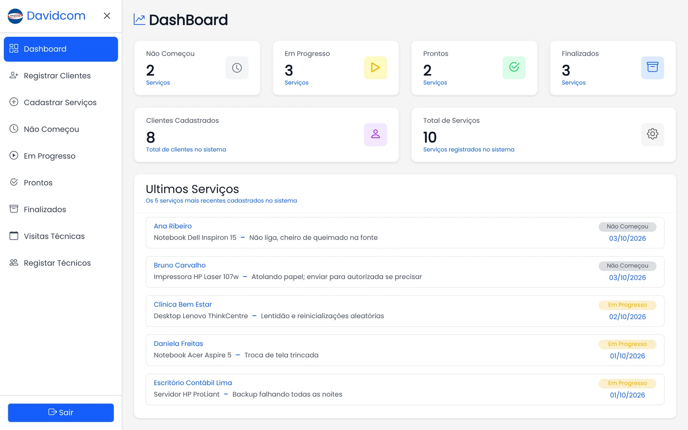
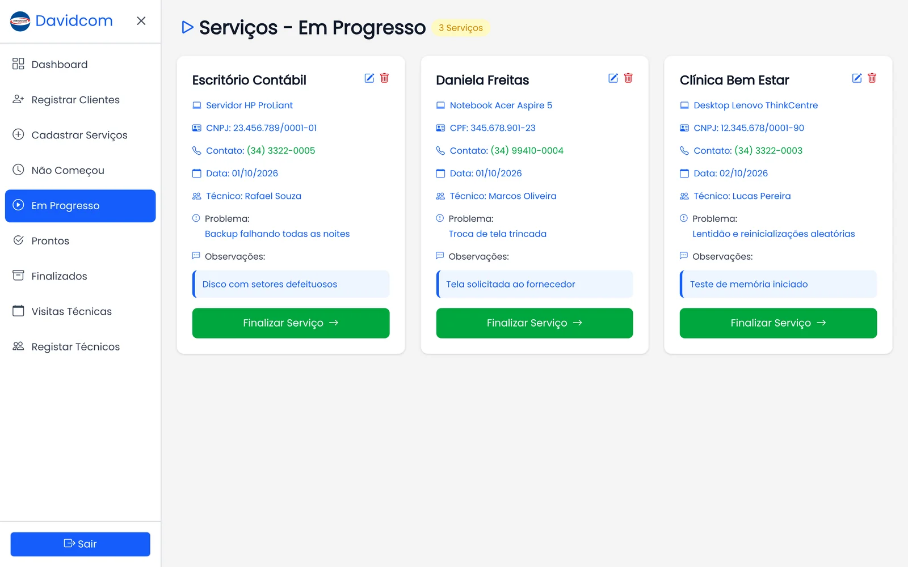
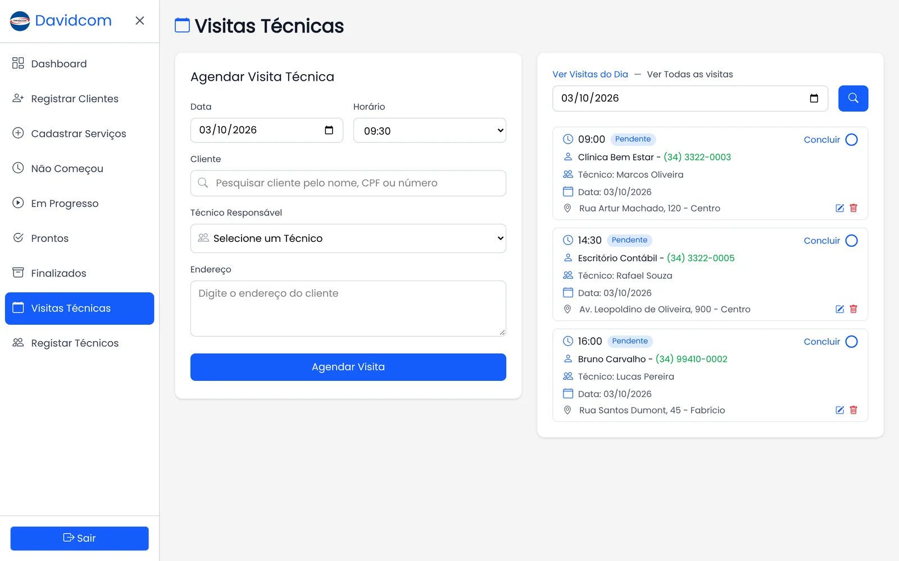

# DavidServices

Sistema de ordens de serviço feito para a **DavidCom Informática**, assistência técnica onde eu trabalhava. Organizava os serviços do balcão até a entrega: técnicos, clientes, equipamentos em cada etapa do conserto e visitas técnicas agendadas.

Foi o meu primeiro sistema em uso real e o projeto em que comecei a estudar PHP puro a fundo. Ele nasceu como evolução do OrganizaLab, um projeto meu de estudo com a mesma ideia, refeito para o dia a dia da DavidCom, que tinha muita demanda de serviço (computadores, notebooks e impressoras que às vezes seguiam para a autorizada). O sistema foi usado pela loja por um bom tempo e hoje está desativado.



## Funcionalidades

- **Técnicos e clientes**: cadastro com CPF/CNPJ e telefone, busca e edição.
- **Ordens de serviço** com equipamento, problema relatado, técnico responsável e observações que vão sendo atualizadas durante o conserto.
- **Quatro etapas por serviço**: Não começou → Em andamento → Pronto → Finalizado, cada uma com sua própria tela.
- **Dashboard** com a contagem de serviços por etapa, total de clientes e os últimos serviços cadastrados.
- **Visitas técnicas**: agenda por dia e horário, sem permitir dois agendamentos no mesmo horário.
- **WhatsApp**: o telefone do cliente vira um link que abre a conversa direto no WhatsApp, sem integração, só para agilizar o contato.
- **Login** com senha em hash e opção "lembrar-me" por token (o cookie guarda o token e o banco guarda só o hash SHA-256 dele, com data de expiração).

| Em andamento | Visitas técnicas |
| --- | --- |
|  |  |

## Tecnologias

- **PHP 8** puro, sem framework, com **PDO** e prepared statements
- **MySQL**
- **Tailwind CSS v4** (CLI)
- **JavaScript** puro para autocomplete, modais e formulários

## Como rodar

Pré-requisitos: PHP 8+, MySQL e Node.js (só para compilar o CSS).

1. Clone o repositório e instale as dependências do Tailwind:

   ```bash
   git clone https://github.com/RuanParreira/DavidServices.git
   cd DavidServices
   npm install
   npm run build
   ```

2. Crie o banco com o schema abaixo e um usuário para acessar:

   ```sql
   CREATE DATABASE davidservices CHARACTER SET utf8mb4 COLLATE utf8mb4_unicode_ci;
   USE davidservices;

   CREATE TABLE users (
     id INT AUTO_INCREMENT PRIMARY KEY,
     name VARCHAR(100),
     email VARCHAR(150) UNIQUE,
     password VARCHAR(255),
     created_at TIMESTAMP DEFAULT CURRENT_TIMESTAMP
   );

   CREATE TABLE user_remember_tokens (
     id INT AUTO_INCREMENT PRIMARY KEY,
     user_id INT,
     token_hash CHAR(64),
     expires_at DATETIME,
     user_agent VARCHAR(255),
     last_used_at DATETIME NULL,
     created_at TIMESTAMP DEFAULT CURRENT_TIMESTAMP
   );

   CREATE TABLE technicians (
     id INT AUTO_INCREMENT PRIMARY KEY,
     name VARCHAR(100),
     cpf VARCHAR(20),
     number VARCHAR(20),
     id_user INT,
     created_at TIMESTAMP DEFAULT CURRENT_TIMESTAMP
   );

   CREATE TABLE clients (
     id INT AUTO_INCREMENT PRIMARY KEY,
     name VARCHAR(100),
     cpf_cnpj VARCHAR(20),
     number VARCHAR(20),
     id_user INT,
     created_at TIMESTAMP DEFAULT CURRENT_TIMESTAMP
   );

   -- status: 1 = Não começou, 2 = Em andamento, 3 = Pronto, 4 = Finalizado
   CREATE TABLE services (
     id INT AUTO_INCREMENT PRIMARY KEY,
     id_user INT,
     id_client INT,
     id_technical INT,
     equipment VARCHAR(150),
     problem TEXT,
     observation TEXT NULL,
     date DATE,
     status TINYINT DEFAULT 1,
     created_at TIMESTAMP DEFAULT CURRENT_TIMESTAMP,
     updated_at TIMESTAMP DEFAULT CURRENT_TIMESTAMP ON UPDATE CURRENT_TIMESTAMP
   );

   -- status: 1 = Pendente, 2 = Concluída
   CREATE TABLE visits (
     id INT AUTO_INCREMENT PRIMARY KEY,
     id_client INT,
     id_user INT,
     id_technical INT,
     date DATE,
     time VARCHAR(5),
     address VARCHAR(255),
     status TINYINT DEFAULT 1,
     created_at TIMESTAMP DEFAULT CURRENT_TIMESTAMP
   );
   ```

   A senha do usuário precisa estar em hash. Gere com:

   ```bash
   php -r 'echo password_hash("sua-senha", PASSWORD_DEFAULT), PHP_EOL;'
   ```

   E insira: `INSERT INTO users (name, email, password) VALUES ('Admin', 'admin@exemplo.com', '<hash>');`

3. Crie um arquivo `.env` na raiz:

   ```env
   DB_HOST=localhost
   DB_USER=root
   DB_PASS=sua-senha
   DB_NAME=davidservices
   ```

4. Suba o servidor e acesse `http://localhost:8000`:

   ```bash
   php -S localhost:8000
   ```

## O que eu faria diferente hoje

Este projeto marca o começo do meu aprendizado com PHP, e olhando para ele hoje eu mudaria algumas coisas:

- **Proteção CSRF**: os formulários não têm token CSRF, algo que passei a tratar como padrão nos sistemas seguintes.
- **Migrations versionadas** em vez de criar o banco à mão.
- **`node_modules` fora do repositório**: a pasta foi versionada por engano.

## Projetos seguintes

O que aprendi aqui virou base para sistemas maiores, como o [Heycaixa](https://heycaixa.com.br), um SaaS de PDV em Laravel. Veja mais no meu portfólio: [ruanparreira.com.br](https://ruanparreira.com.br).

---

Desenvolvido por [Ruan Parreira](https://github.com/RuanParreira).
